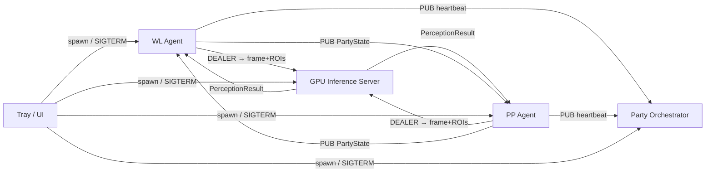
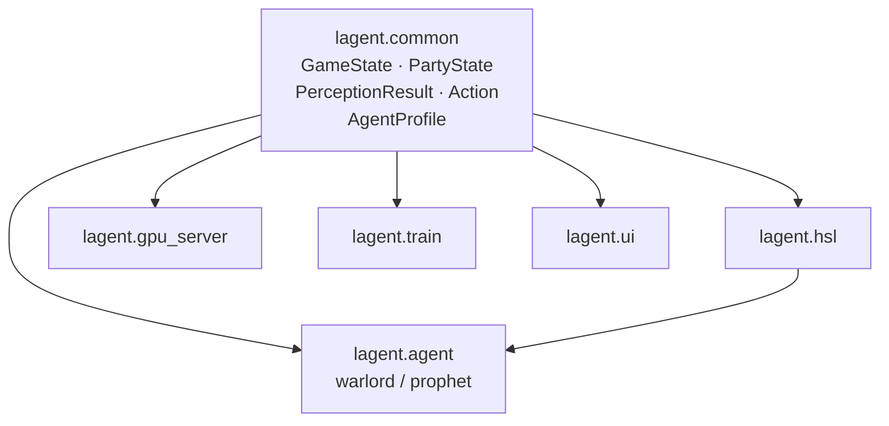

# Architecture Spine — LAgent

## Design Paradigm

**Actor model with pipes-and-filters inner loop.**

Each runtime entity is an autonomous OS process with no shared memory. The WL Agent and PP Agent each own a linear perception pipeline (capture → GPU inference → FSM+policy → HSL → OS input). The GPU Inference Server, Party Orchestrator, and Tray/UI are separate actors. All cross-process coupling is ZeroMQ messages. No process imports from another at runtime.



## Invariants & Rules

### AD-1 — All cross-process communication is ZeroMQ; no shared memory

- **Binds:** All processes
- **Prevents:** Shared mutable state across agents; GIL contention; non-deterministic cross-agent coupling
- **Rule:** No process may communicate with another via filesystem polling, shared memory, OS pipes, or any mechanism other than ZeroMQ sockets. All inter-process data shapes are defined in `lagent.common` only.

### AD-2 — One GPU Inference Server owns all GPU calls

- **Binds:** WL Agent, PP Agent, GPU Inference Server
- **Prevents:** Non-deterministic GPU starvation between agents; CUDA stream contention from concurrent inference threads
- **Rule:** No Agent process may load a YOLO or EasyOCR model or issue any CUDA call. All vision inference (YOLO + EasyOCR OCR) runs exclusively in the GPU Inference Server process. Agents send `{agent_id, frame_bytes, roi_map}` and receive `PerceptionResult`; they perform no vision work.

### AD-3 — Agent-internal queues use oldest-frame eviction; capture thread never blocks

- **Binds:** All Agent-internal inter-stage queues (capture→inference-request, inference-result→policy)
- **Prevents:** Cascading pipeline stall from a slow GPU tick
- **Rule:** Every bounded queue drops the oldest item when full. The capture thread is never blocked by a downstream stage. Max queue depth: 2 frames per stage per agent.

### AD-4 — Each Agent owns its GameState exclusively

- **Binds:** WL Agent, PP Agent, Party Orchestrator
- **Prevents:** Shared mutable state contention; two agents writing the same GameState object
- **Rule:** An Agent's `GameState` object is constructed and mutated only within that Agent's process. The only state crossing process boundaries is the `PartyState` subset (FSM state, HP%, MP%, position, buff presence). The Orchestrator never reads `GameState`.

### AD-5 — Control surface: system tray + minimal status overlay; Tray/UI is the sole process launcher

- **Binds:** UI subsystem
- **Prevents:** Heavyweight GUI loading into the live session process; runtime processes launching themselves
- **Rule:** The Tray/UI process is the exclusive launcher of all runtime child processes (WL Agent, PP Agent, GPU Inference Server, Orchestrator). It may read `sessions.db` for status display. It never imports `lagent.agent`, `lagent.hsl`, or `lagent.gpu_server`.

### AD-6 — Training Pipeline is a separate CLI; never co-runs with a live Session

- **Binds:** `lagent.train`
- **Prevents:** PyTorch Lightning and MLflow server loading into the runtime process; training (4–6 GB VRAM) and inference sharing the GPU simultaneously
- **Rule:** Training is invoked exclusively via `python -m lagent.train <subcommand>`. A live Session and a training run must not run concurrently on the same machine.

### AD-7 — Model versioning via convention-based atomic path swap

- **Binds:** GPU Inference Server, Training Pipeline
- **Prevents:** Runtime startup dependency on MLflow server; non-atomic model swap mid-session
- **Rule:** The Training Pipeline writes a validated model to `models/<class>/current.pt` via temp-write + `os.replace()`. The GPU Inference Server loads `current.pt` at startup only — no in-session reload, no MLflow query on the critical path.

### AD-8 — Human Simulation Layer: shared library, per-agent stateful instances; non-bypassable

- **Binds:** WL Agent, PP Agent, all action execution paths
- **Prevents:** Two agents sharing fatigue state; HSL bypassed by any code path
- **Rule:** Every `Action` produced by any policy must pass through the caller's local `HSL` instance before reaching the OS input API. `HSL` is imported from `lagent.hsl` and instantiated once per Agent process. `HSL.fatigue_state` and `HSL.timing_params` are instance-level — never module-level globals. Shadow Mode is implemented inside `HSL` by suppressing the OS call while still logging the shaped action.

### AD-9 — Session telemetry: single WAL-mode SQLite DB, all processes write via separate connections

- **Binds:** WL Agent, PP Agent, Party Orchestrator
- **Prevents:** Per-process DB files requiring post-session merge to query party-wide event sequences
- **Rule:** All processes append to `data/sessions.db` (WAL mode, one connection per process, no exclusive lock). Schema: `sessions(session_id, started_at, profile, mode)`, `events(id, session_id, ts, source, type, payload_json)`.

### AD-10 — OCR runs in the GPU Inference Server; Agents consume PerceptionResult only

- **Binds:** GPU Inference Server API, WL Agent, PP Agent
- **Prevents:** Split perception responsibility; CPU-only OCR path adding 30–50 ms to the Agent decision cycle
- **Rule:** The GPU Inference Server accepts `{agent_id, frame_bytes, roi_map}` and returns `PerceptionResult{detections: list[Detection], ocr_values: dict[str, str]}`. No Agent process runs EasyOCR or any pixel-level image operation.
  Canonical `Detection` fields (defined in `lagent.common.types`, never redefined locally): `class_name: str`, `confidence: float`, `bbox_xyxy: tuple[int,int,int,int]` (pixel coordinates in the captured frame, origin top-left).

### AD-10b — All spatial measurements use frame-pixel coordinates; no game-world coordinate system

- **Binds:** PP Agent Safety Check, any component that reasons about spatial proximity
- **Prevents:** Builder A measuring Safety Check radius in screen pixels while Builder B uses game-world units — incompatible radius logic that produces opposite pass/fail decisions
- **Rule:** All proximity and radius calculations use pixel coordinates from the captured game window frame (origin top-left, matching `Detection.bbox_xyxy`). No game-world coordinate space exists in V1 — it is not extracted and not used.

### AD-11 — ZeroMQ socket patterns are fixed per channel

- **Binds:** All inter-process ZeroMQ channels
- **Prevents:** Blocking REQ/REP on the inference path; mixed patterns making message routing ambiguous
- **Rule:**
  - Agent → GPU Server: DEALER (agent) / ROUTER (server). Async, correlation by `agent_id`.
  - Party Bus state: PUB (each agent) / SUB (peer agent). Fire-and-forget.
  - Orchestrator heartbeat monitoring: SUB on each Agent's PUB endpoint — heartbeat is a message type on the same Party Bus PUB socket, not a separate socket.
  - No REQ/REP socket is used anywhere in the runtime.

### AD-12 — Dependency direction: `lagent.common` is the only shared import; processes never import each other

- **Binds:** All modules
- **Prevents:** Circular imports; training deps loading into runtime; agents cross-importing
- **Rule:** Allowed import graph only:



No module in this graph may add a reverse or cross edge. `lagent.train` may import `lagent.common` types only.

### AD-13 — Recording Mode runs inside the Agent process; mutually exclusive with live Session

- **Binds:** WL Agent, Recording Mode
- **Prevents:** Separate recorder process adding IPC complexity; co-running record + live session
- **Rule:** A `--record` flag at process launch switches the Agent's capture thread to dual-write (pipeline + disk archive) and activates a second `pynput` listener for input logging. Recording Mode and Session Mode are mutually exclusive at process launch — not toggle-able at runtime.

## Consistency Conventions

| Concern | Convention |
|---|---|
| Module naming | `lagent.<subsystem>` — snake_case; abbreviations only for established terms (hsl, gpu) |
| ZeroMQ message encoding | JSON (stdlib `json`); switch to MessagePack only if profiling identifies serialization as a bottleneck |
| Model file paths | `models/<class_name>/current.pt` and `models/common/current.pt` — lowercase, underscore |
| Process entry points | Each runnable process is `python -m lagent.<subsystem>` via `__main__.py` |
| Agent profiles | YAML + Pydantic v2 schema validation at process start; one file per character class in `profiles/` |
| ZeroMQ error responses | `{ok: false, error: str, code: str}` — uniform across all sockets |
| Logging | `structlog` JSON lines to stdout per process; FSM transitions and session events additionally written to `sessions.db` |
| GameState mutation | `GameState` is replaced (not mutated in place) each perception cycle — new dataclass instance per tick |
| FSM transitions | Logged to `sessions.db` `events` table within one decision cycle of transition |
| Config loading order | `profiles/<class>.yaml` → Pydantic validation → fail-fast at startup; no runtime fallback to defaults |

## Stack

| Name | Version | Scope |
|---|---|---|
| Python | 3.12 | all |
| dxcam | 0.0.5 | runtime capture (Windows/DirectX) |
| mss | 9.0.x | runtime capture fallback |
| Ultralytics YOLOv8-nano | 8.2.x | GPU Inference Server |
| EasyOCR | 1.7.x | GPU Inference Server |
| PyTorch (CUDA 11.8) | 2.3.x | GPU Inference Server |
| pyzmq | 26.x | all runtime processes |
| Pydantic v2 | 2.7.x | all (common types + profiles) |
| pynput | 1.7.x | Agent (input simulation + recording) |
| pywin32 (win32api) | 306 | Agent (low-level input API) |
| structlog | 24.x | all |
| SQLite | stdlib | all (sessions.db) |
| pystray | 0.19.x | UI |
| PyQt6 | 6.7.x | UI (status overlay) |
| PyTorch Lightning | 2.3.x | train only |
| MLflow | 2.13.x | train only |
| yt-dlp | 2024.x | train only |
| OpenCV | 4.10.x | train only |
| Label Studio | 1.12.x | train only (local) |

## Structural Seed

```text
lagent/
  common/           # Shared types: GameState, PartyState, PerceptionResult, Action, AgentProfile
    __init__.py
    types.py        # Pydantic v2 dataclasses for all shared types
  hsl/              # Human Simulation Layer — Bézier, timing noise, fatigue, micro-drift, error injection
    __init__.py
    bezier.py
    fatigue.py
    timing.py
  agent/            # Agent process base + class-specific implementations
    __init__.py
    __main__.py     # Entry: python -m lagent.agent --class warlord|prophet [--record] [--shadow]
    base.py         # Capture thread, queue wiring, policy loop, action dispatch
    warlord/        # WL FSM states, BC Policy modules, skill bindings
    prophet/        # PP FSM states, buff timers, Safety Check
  gpu_server/       # GPU Inference Server — YOLO + EasyOCR, DEALER/ROUTER
    __init__.py
    __main__.py     # Entry: python -m lagent.gpu_server
    server.py       # ZeroMQ ROUTER loop, batch dispatch
    inference.py    # YOLO + EasyOCR inference logic
  orchestrator/     # Party Orchestrator — heartbeat monitor, Party Bus SUB relay
    __init__.py
    __main__.py     # Entry: python -m lagent.orchestrator
  ui/               # Tray app + status overlay
    __init__.py
    __main__.py     # Entry: python -m lagent.ui
    tray.py
    overlay.py
  train/            # Training Pipeline CLI
    __init__.py
    __main__.py     # Entry: python -m lagent.train prelabel|train|ingest
    prelabel.py
    trainer.py
    ingest.py       # yt-dlp + OpenCV frame extraction
models/
  common/
    current.pt      # Active Common YOLO model (replaced atomically via os.replace)
  warlord/
    current.pt
  prophet/
    current.pt
profiles/
  warlord.yaml      # ROI positions, FSM bindings, skill keys, buff timers, thresholds
  prophet.yaml
recordings/         # Frame archives + synchronized input logs from Recording Mode
data/
  sessions.db       # WAL-mode SQLite — sessions + events tables
```

## Capability → Architecture Map

| Capability / FR | Lives in | Governed by |
|---|---|---|
| Per-window screen capture (FR-1) | `lagent.agent.base` capture thread | AD-3, AD-13 |
| ROI extraction (FR-2) | `lagent.gpu_server.inference` | AD-10 |
| Object & state detection / YOLO (FR-3) | `lagent.gpu_server.inference` | AD-2, AD-10 |
| Numeric OCR (FR-4) | `lagent.gpu_server.inference` | AD-2, AD-10 |
| Combined FSM + BC Policy (FR-5) | `lagent.agent.{warlord,prophet}` | AD-4, AD-12 |
| Party Bus + PP Safety Check (FR-6) | `lagent.agent.prophet`, `lagent.orchestrator` | AD-1, AD-4, AD-11 |
| YAML agent profile (FR-7) | `lagent.common.AgentProfile`, `profiles/` | AD-12, conventions |
| Bézier mouse paths (FR-8) | `lagent.hsl.bezier` | AD-8 |
| Keystroke timing noise (FR-9) | `lagent.hsl.timing` | AD-8 |
| Fatigue model (FR-10) | `lagent.hsl.fatigue` | AD-8 |
| Micro-drift (FR-11) | `lagent.hsl` | AD-8 |
| Error injection (FR-12) | `lagent.hsl` | AD-8 |
| Party Bus relay (FR-13) | `lagent.orchestrator` | AD-1, AD-11 |
| Session health monitoring (FR-14) | `lagent.orchestrator` | AD-9 |
| Character identification (FR-15) | `lagent.agent.base` startup | AD-4 |
| Death detection + recovery (FR-16) | `lagent.agent.{warlord,prophet}` FSM | AD-4 |
| Inventory-full + town return (FR-17) | `lagent.agent.{warlord,prophet}` FSM | AD-4 |
| Session cap + shutdown (FR-18) | `lagent.agent.base`, `lagent.orchestrator` | AD-9 |
| Recording Mode (FR-19) | `lagent.agent.base` capture thread | AD-13 |
| Auto-prelabeling (FR-20) | `lagent.train.prelabel` | AD-6 |
| Model training (FR-21) | `lagent.train.trainer` | AD-6, AD-7 |
| YouTube ingestion (FR-22) | `lagent.train.ingest` | AD-6 |
| Shadow Mode (FR-24) | `lagent.hsl` (suppresses OS call, logs shaped action) | AD-8 |
| Fishing Mode loop (FR-25) | `lagent.agent.warlord` FSM states | AD-4 |

## Deferred

- **Per-epic FSM state enumeration and BC Policy model architecture** — exact states, transitions, and whether BC Policy uses LSTM/MLP/transformer — owned by epic-level spines.
- **GPU Inference Server batching strategy** — whether to batch both agents' frames into one YOLO forward pass per tick vs. two sequential calls — deferred to implementation; AD-2 fixes ownership, not call strategy.
- **ZeroMQ message schema versioning** — backward-compatible evolution strategy if `PerceptionResult` or `PartyState` shapes change post-V1.
- **Phase 3+ process topology** — 3-window (Spoiler) and whether a third Agent process requires changes to the GPU Inference Server's batching or the Orchestrator's relay model — deferred to Phase 3.
- **Operational monitoring beyond session log** — remote status visibility (phone, browser dashboard) — not in V1 scope.
- **Keystroke timing parameter bootstrap values** — exact default Gaussian means and std-devs before training data is collected; owned by HSL implementation.
