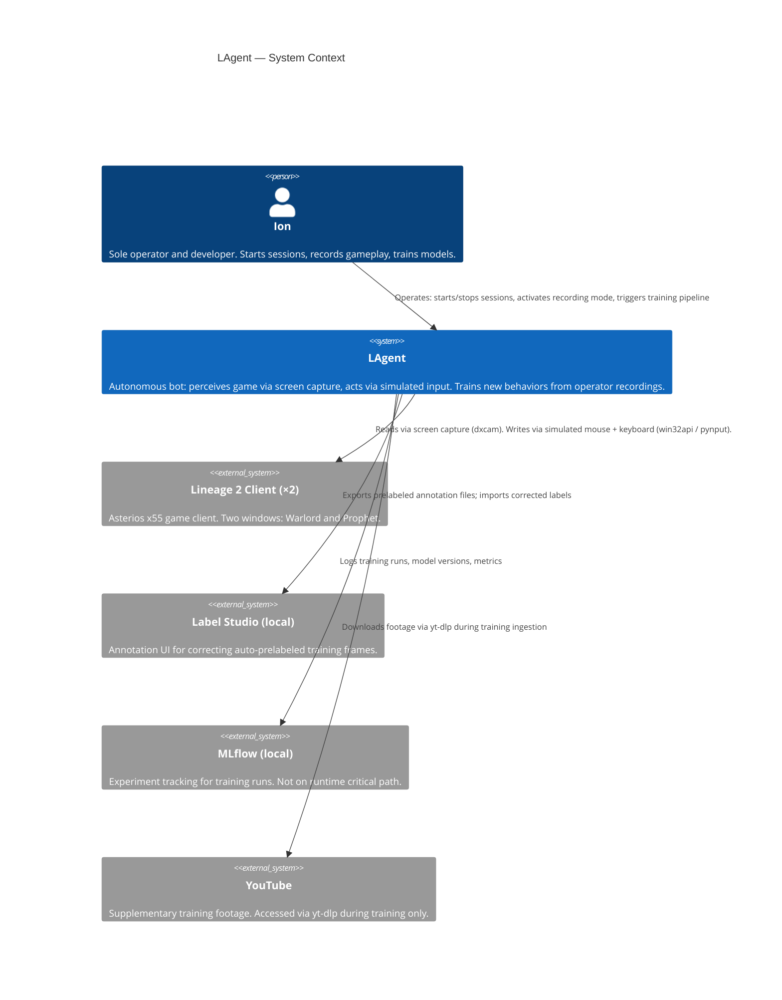
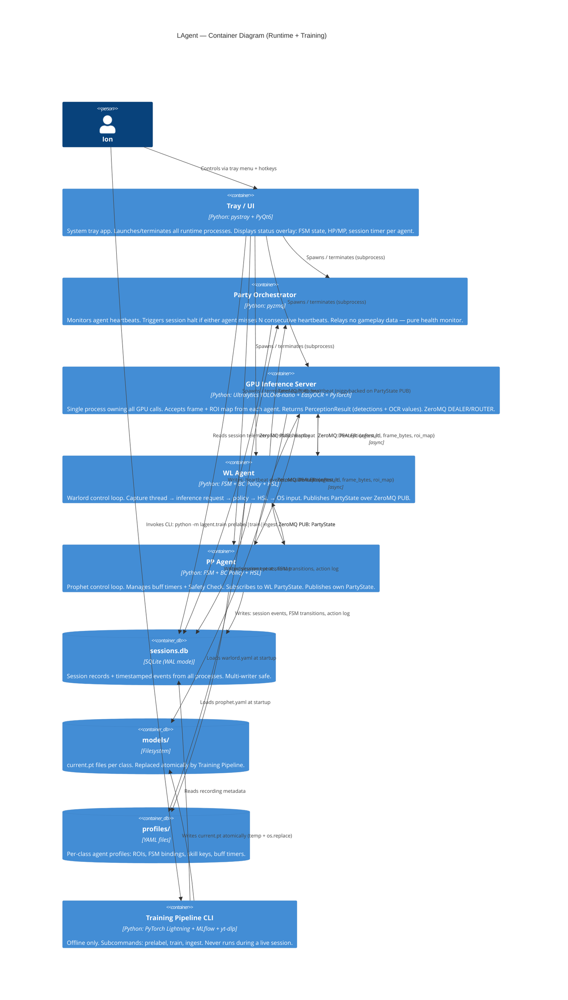
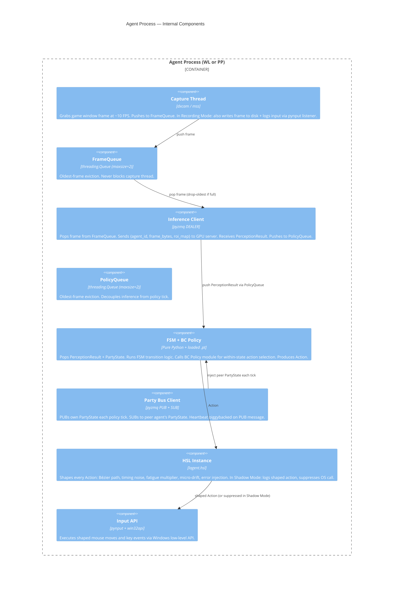
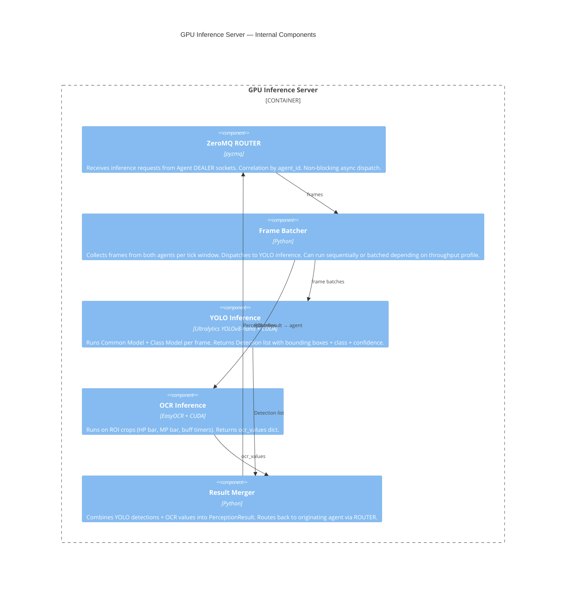
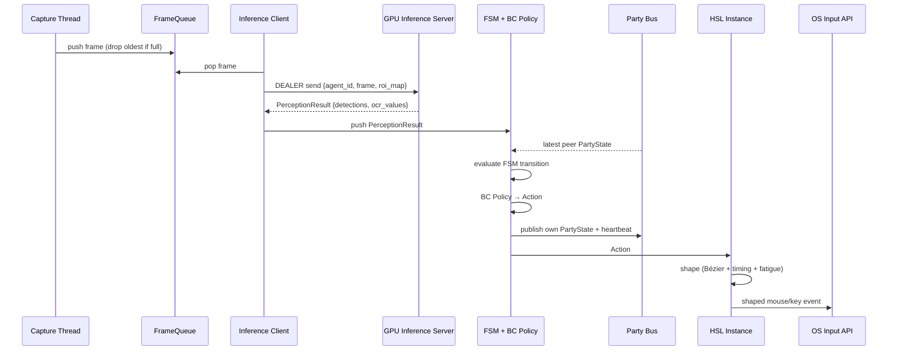
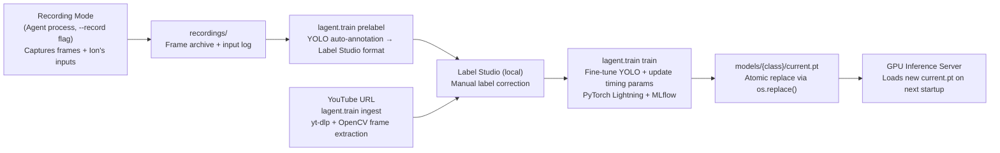
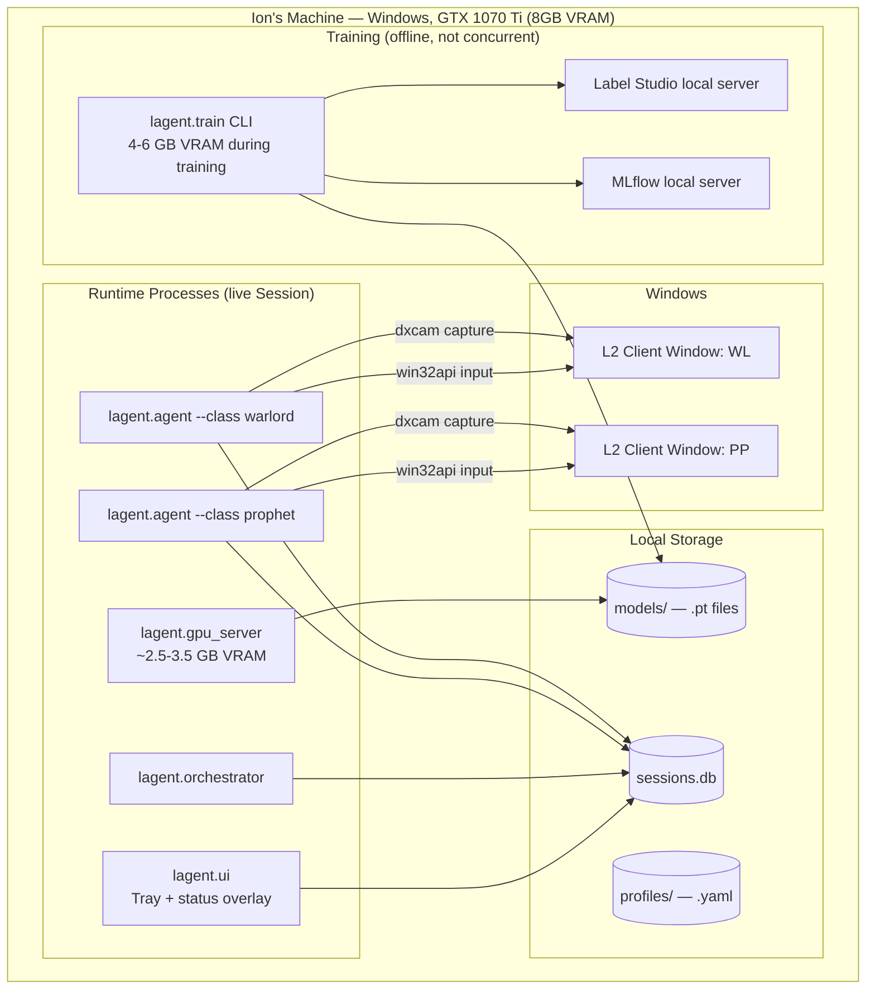

# LAgent — Solution Design

**Project:** LAgent — Autonomous L2 Asterios x55 AI Bot  
**Date:** 2026-08-04  
**Author:** Winston (System Architect, BMad)  
**Audience:** Ion (sole developer and operator)  
**Companion:** [ARCHITECTURE-SPINE.md](./ARCHITECTURE-SPINE.md)

---

## 1. System Overview

LAgent is a fully local, screen-vision-only autonomous bot for Lineage 2 on the Asterios x55 private server. It manages a 2-character party (Warlord + Prophet) by reading the screen and simulating human mouse and keyboard input — with zero client modification, memory reading, or packet injection.

The system has two operational modes:

| Mode | What runs | Purpose |
|---|---|---|
| **Live Session** | 5 OS processes | Autonomous farming / fishing |
| **Training Pipeline** | CLI tool (offline) | Produce new vision + behavior models |

These modes are **mutually exclusive** — training requires 4–6 GB VRAM and must not run during a live session.

---

## 2. C4 Diagrams

### 2.1 Level 1 — System Context

Who and what interacts with LAgent.



---

### 2.2 Level 2 — Container Diagram

The 5 runtime OS processes and the offline Training Pipeline.



---

### 2.3 Level 3 — Agent Component Diagram

The internal structure of a single Agent process (WL or PP — identical base, different FSM/policy).



---

### 2.4 Level 3 — GPU Inference Server Component Diagram



---

## 3. Key Data Flows

### 3.1 Normal Per-Tick Perception-Decision-Action Loop



---

### 3.2 PP Buff Safety Check Flow

```mermaid
sequenceDiagram
    participant PP as PP FSM
    participant BUS as Party Bus (SUB)
    participant HSL as HSL Instance

    PP->>PP: buff timer expires
    PP->>BUS: read latest WL PartyState
    alt Safety Check passes\n(no mobs in aggro radius AND WL not PULLING)
        PP->>HSL: cast buff Action
        HSL->>HSL: shape + execute
    else Safety Check fails
        PP->>PP: defer by retry_interval; re-evaluate next tick
    end
    note over PP: cast is never skipped — only deferred
```

---

### 3.3 Death Recovery Flow

```mermaid
sequenceDiagram
    participant WL as WL Agent FSM
    participant PP as PP Agent FSM
    participant BUS as Party Bus

    WL->>WL: detect DEAD state (PerceptionResult)
    WL->>BUS: publish PartyState{fsm=DEAD}
    PP->>BUS: read WL PartyState{fsm=DEAD}
    WL->>WL: execute respawn sequence
    PP->>PP: hold combat; await WL BUFFING state
    WL->>WL: navigate to buff position
    WL->>BUS: publish PartyState{fsm=BUFFING}
    PP->>PP: Safety Check → execute full buff cycle on WL
    PP->>BUS: publish PartyState{fsm=IDLE}
    WL->>WL: transition IDLE → PULLING
    note over WL,PP: full recovery target ≤60s (FR-16)
```

---

### 3.4 Training Pipeline Flow (Offline)



---

## 4. Process Topology & Port Map

All ZeroMQ binds are localhost-only. Suggested port assignments:

| Process | Socket type | Port | Direction |
|---|---|---|---|
| GPU Inference Server | ROUTER (bind) | 5555 | receives from both agents |
| WL Agent | DEALER (connect) | 5555 | sends frames to GPU server |
| PP Agent | DEALER (connect) | 5555 | sends frames to GPU server |
| WL Agent | PUB (bind) | 5556 | publishes PartyState + heartbeat |
| PP Agent | PUB (bind) | 5557 | publishes PartyState + heartbeat |
| PP Agent | SUB (connect) | 5556 | subscribes to WL PartyState |
| WL Agent | SUB (connect) | 5557 | subscribes to PP PartyState |
| Orchestrator | SUB (connect) | 5556, 5557 | monitors both PUB streams |

All ports are configurable in `profiles/` or a top-level `config.yaml`.

---

## 5. Deployment View

Single Windows machine. No network egress during runtime.



**VRAM budget (runtime, steady state):**

| Component | Estimated VRAM |
|---|---|
| 2× L2 game windows (DirectX) | ~1–2 GB (shared) |
| YOLOv8-nano ×2 models (Common + Class) | ~400–600 MB |
| EasyOCR | ~300–500 MB |
| PyTorch runtime overhead | ~300 MB |
| **Total** | **~2.5–3.5 GB** — comfortable on 8 GB |

Training is offline and uses a separate 4–6 GB budget.

---

## 6. Architectural Decision Summary

| AD | Decision | Key constraint it prevents |
|---|---|---|
| AD-1 | ZeroMQ-only cross-process comms | Shared mutable state; GIL contention |
| AD-2 | Dedicated GPU Inference Server | GPU starvation / CUDA stream contention between agents |
| AD-3 | Oldest-frame eviction queues | Cascading pipeline stall from slow inference tick |
| AD-4 | Per-agent exclusive GameState | Shared state contention; cross-agent mutation |
| AD-5 | Tray + overlay; UI is sole launcher | Heavyweight GUI in session process; rogue process spawning |
| AD-6 | Training as separate CLI | VRAM co-use; training deps in runtime |
| AD-7 | Convention-based atomic model swap | Runtime MLflow dependency; mid-session model replacement |
| AD-8 | HSL per-agent instance; non-bypassable | Shared fatigue state; HSL bypass creating detectable straight-line input |
| AD-9 | Single WAL-mode SQLite DB | Per-process DB files requiring post-session merge |
| AD-10 | OCR in GPU server | Split perception responsibility; CPU OCR latency in agent cycle |
| AD-11 | Fixed ZeroMQ socket patterns per channel | Blocking REQ/REP on inference path; ambiguous routing |
| AD-12 | `lagent.common` only shared import | Circular imports; training deps loading into runtime |
| AD-13 | Recording Mode inside Agent; launch-time exclusive | Separate recorder process IPC complexity; record+session co-run |

---

## 7. Open Questions & Deferred Decisions

| Item | Deferred to |
|---|---|
| Per-class FSM state enumeration and transition conditions | Epic-level spines |
| BC Policy model architecture (LSTM / MLP / transformer) | Epic-level spines |
| GPU Inference Server batching strategy (batched vs. sequential YOLO calls) | Implementation |
| ZeroMQ message schema versioning strategy (post-V1) | Post-V1 |
| Phase 3+ topology (3rd Agent window for Spoiler) | Phase 3 |
| Keystroke timing parameter bootstrap defaults | HSL implementation |
| Operational monitoring beyond session log | Not in V1 |
